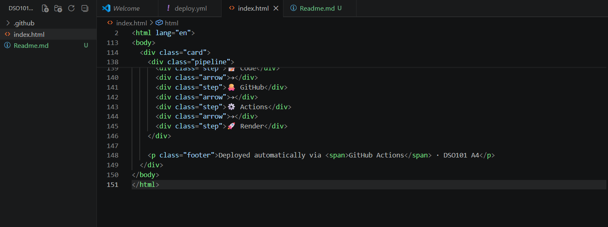
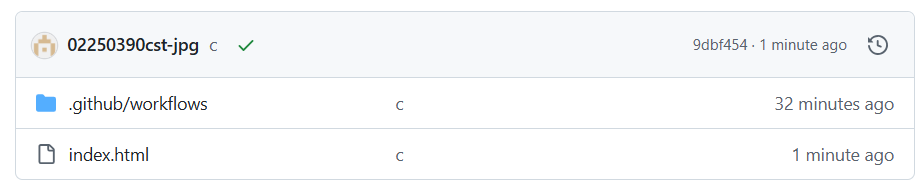
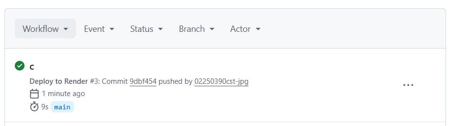
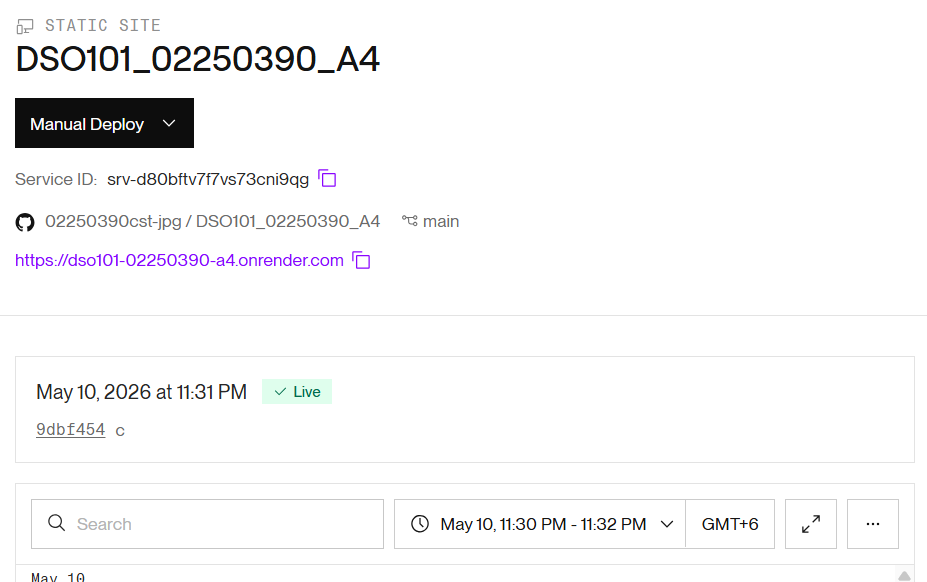
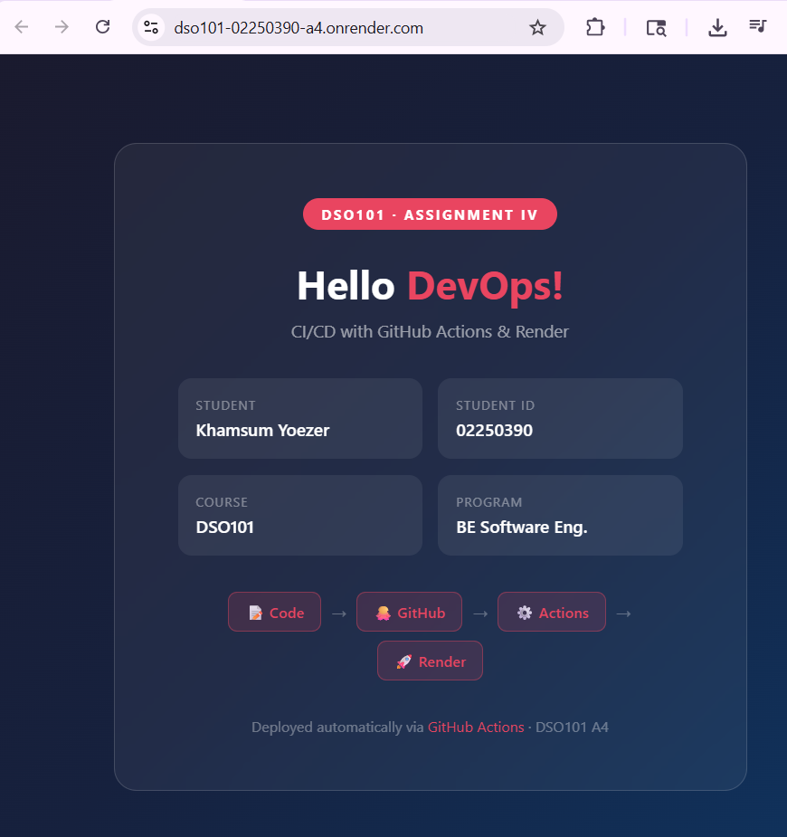

# DSO101 Assignment IV – CI/CD with GitHub Actions & Render

## Project Overview

This project is a simple static web application created for the DSO101 Assignment IV. The application demonstrates the implementation of a basic CI/CD (Continuous Integration and Continuous Deployment) pipeline using GitHub Actions and Render.

The webpage contains student information, course details, and a visual representation of the deployment workflow.

---

## Student Information

* **Student Name:** Khamsum Yoezer
* **Student ID:** 02250390
* **Course:** DSO101
* **Program:** BE Software Engineering

---

## Technologies Used

* HTML5
* CSS3
* Git & GitHub
* GitHub Actions
* Render

---

## Features

* Responsive modern UI design
* Gradient background with glassmorphism effect
* CI/CD pipeline integration
* Automatic deployment using GitHub Actions and Render

---

## CI/CD Workflow

The project follows a simple CI/CD workflow:

1. Developer writes code locally
2. Code is pushed to GitHub repository
3. GitHub Actions automatically triggers workflow
4. Render deploys the updated application
5. Live application is updated automatically

### Workflow Screenshots

#### Step 1: Creating the Project

#### Step 2: Pushing Code to GitHub

#### Step 3: GitHub Actions Workflow

#### Step 4: Render Deployment

#### Step 5: Final Output

---

## Deployment

The application is deployed using:

* **GitHub Actions** for automation
* **Render** for hosting and deployment

Whenever new changes are pushed to the repository, the application is automatically redeployed.

---

## Output

The application displays:

* Assignment title
* Student information
* Course details
* CI/CD workflow pipeline
* Deployment information

---

## Learning Outcomes

Through this assignment, the following concepts were learned:

* Version control using Git and GitHub
* Setting up GitHub repositories
* Creating automated workflows using GitHub Actions
* Deploying web applications using Render
* Understanding CI/CD concepts

---

## Conclusion

This assignment successfully demonstrates the implementation of a basic DevOps workflow using GitHub Actions and Render. The project helped in understanding how modern deployment pipelines automate the process of testing and deploying web applications.

---

